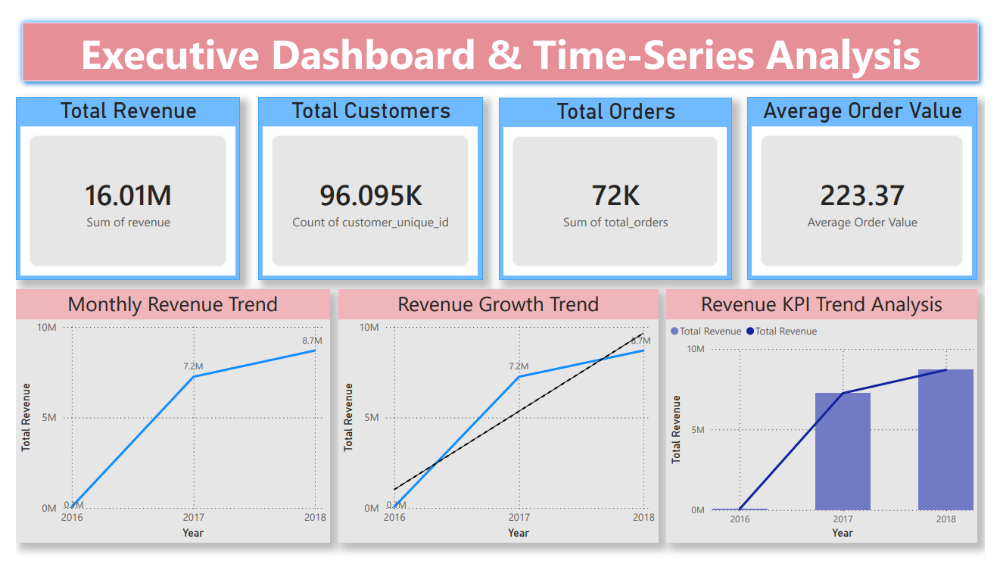
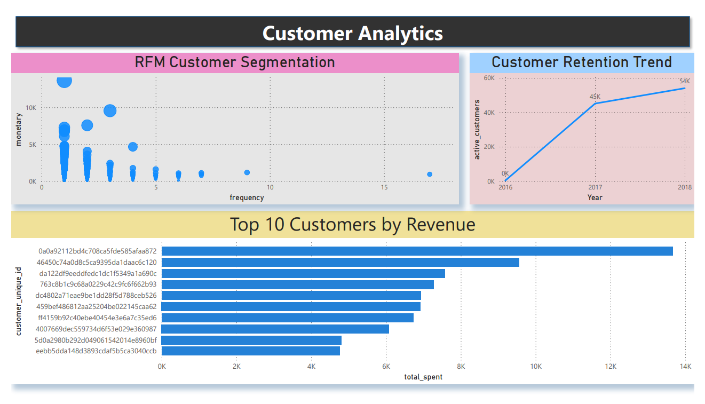
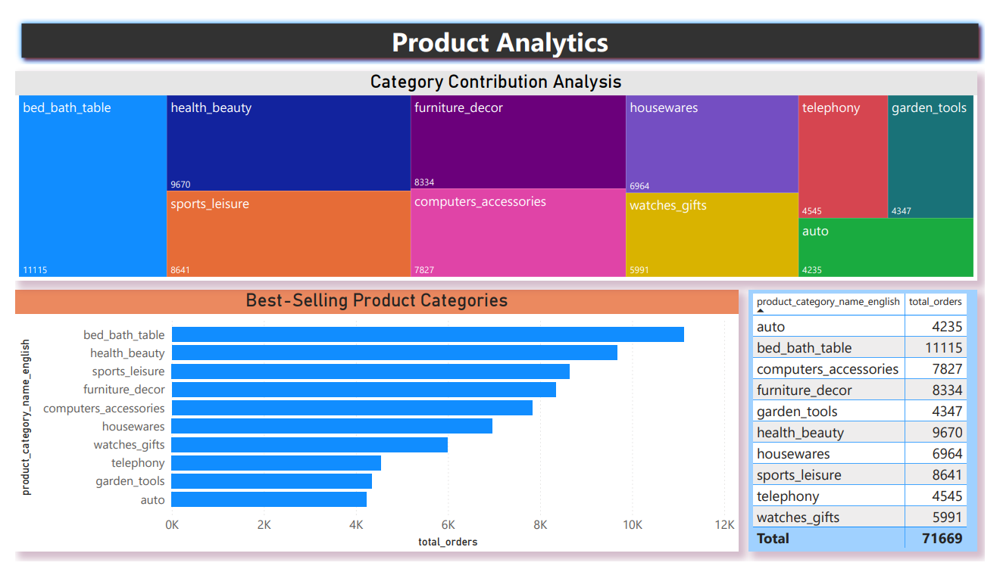
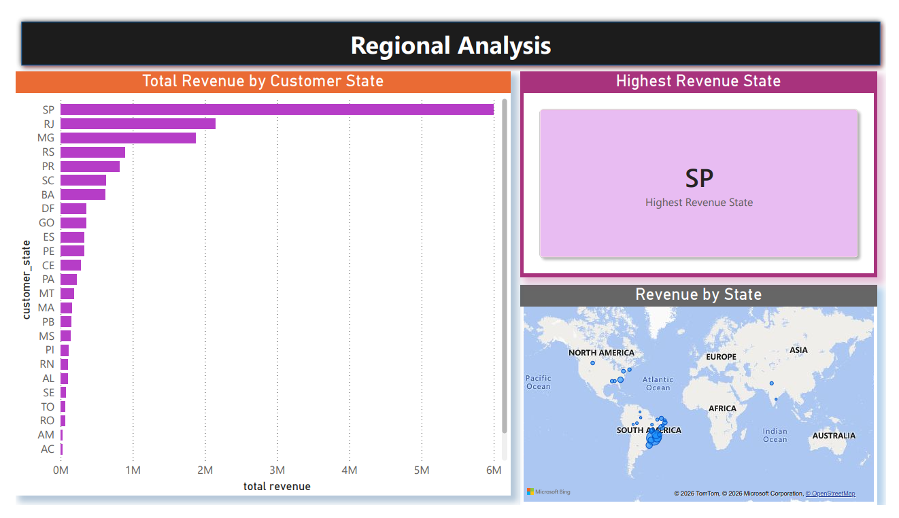

# 📊 Retail Analytics & Customer Intelligence Platform

> An end-to-end Business Intelligence project that leverages **SQL**, **Power BI**, and **advanced analytics** to transform raw e-commerce data into actionable business insights. The project focuses on customer behavior, sales performance, product analytics, and regional revenue trends to support data-driven decision-making.

---

## 📌 Project Overview

Retail businesses generate massive amounts of transactional data every day. However, deriving meaningful insights from this data requires effective analytics and visualization.

This project demonstrates a complete analytics workflow—from SQL-based data analysis to interactive Power BI dashboards—to help business stakeholders monitor KPIs, understand customer behavior, evaluate product performance, and identify regional sales opportunities.

---

## 🎯 Objectives

- Develop an end-to-end Retail Analytics solution using SQL and Power BI.
- Analyze customer purchasing behavior using RFM Analysis.
- Monitor key business KPIs through interactive dashboards.
- Identify best-selling products and high-value customers.
- Analyze revenue trends and regional performance.
- Deliver business insights that support strategic decision-making.

---

## 🛠️ Tech Stack

| Category | Technologies |
|----------|--------------|
| Programming | SQL |
| Business Intelligence | Power BI |
| Database | MySQL |
| Data Transformation | Power Query |
| Advanced Analytics | RFM Analysis, Window Functions, CTEs |
| Visualization | Power BI Dashboards |

---

---
## 🗂️ Dataset

The **Olist Brazilian E-Commerce Dataset** was used.

The dataset includes:
-	Customers 
-	Orders 
-	Products 
-	Payments 
-	Reviews 
-	Sellers 
-	Geolocation data

Due to GitHub file size limitations, raw datasets are not included in this repository.

**Dataset Source:**
https://www.kaggle.com/datasets/olistbr/brazilian-ecommerce

---
## 📂 Repository Structure

```text
Retail-Analytics-Customer-Intelligence/
│
├── README.md
├── LICENSE
│
├── sql/
│   ├── 01_create_database
│   ├── 02_create_tables
│   ├── 03_import_data
|   ├── 04_data_cleaning
|   ├── 05_business_analysis
|   ├── 06_advanced_analysis
│   └── 07_views
│
└── dashboards/
│   ├── Retail_Analytics.pbix
│   ├── Dashboard_Preview.pdf
│   └── screenshots/
│
└── results/
    ├── customer_retention_analysis.csv
    ├── customer_revenue_ranking.csv
    ├── monthly_revenue.csv
    ├── rfm_analysis.csv
    ├── state_sales.csv
    ├── top_customers.csv
    └── top_product_categories.csv
```

---

# 🔄 Project Workflow

```text
Raw Dataset
      │
      ▼
Data Cleaning
      │
      ▼
SQL Analysis
      │
      ▼
Customer Segmentation (RFM)
      │
      ▼
Power BI Data Model
      │
      ▼
Dashboard Development
      │
      ▼
Business Insights
      │
      ▼
Strategic Recommendations
```

---

# 📊 Dashboard Overview

The Power BI solution consists of four interactive dashboards that provide a comprehensive overview of business performance.

---

## 📈 Executive Dashboard & Time-Series Analysis



### Highlights

- Total Revenue
- Total Customers
- Total Orders
- Average Order Value
- Monthly Revenue Trend
- Revenue Growth Trend
- KPI Trend Analysis

---

## 👥 Customer Analytics



### Highlights

- RFM Customer Segmentation
- Customer Retention Trend
- Top 10 Customers by Revenue

---

## 📦 Product Analytics



### Highlights

- Best-Selling Product Categories
- Category Contribution Analysis
- Product Performance Dashboard

---

## 🌍 Regional Analysis



### Highlights

- Revenue by Customer State
- Highest Revenue State
- Geographic Revenue Distribution

---

# 📌 Key Business KPIs

| KPI | Description |
|------|-------------|
| Total Revenue | Overall business revenue |
| Total Customers | Unique customers served |
| Total Orders | Total completed orders |
| Average Order Value | Average revenue generated per order |
| Customer Retention | Active customer trend over time |
| RFM Segmentation | Customer value classification |
| Product Performance | Best-selling product categories |
| Regional Revenue | Revenue contribution by state |

---

# 💡 Business Insights

The analysis provides actionable insights including:

- Identification of high-value customers using RFM Analysis.
- Monitoring customer retention trends over time.
- Detection of top-performing product categories.
- Analysis of revenue growth across multiple years.
- Regional revenue comparison to identify high-performing markets.
- Executive KPI tracking for business performance monitoring.

---

# 📈 SQL Techniques Used

- Common Table Expressions (CTEs)
- Window Functions
- Aggregate Functions
- Joins
- Group By & Having
- Ranking Functions
- Customer Segmentation (RFM)
- KPI Calculations

---

# 📊 Power BI Features

- Interactive Dashboards
- KPI Cards
- Drill-down Visualizations
- Time-Series Analysis
- Geographic Maps
- Dynamic Filters & Slicers
- Business Performance Monitoring

---

# 🎯 Business Value

This solution enables stakeholders to:

- Monitor business performance in real time.
- Identify high-value customers.
- Improve customer retention strategies.
- Optimize product portfolio decisions.
- Analyze regional sales performance.
- Support data-driven strategic decision-making.

---

# 🚀 Future Enhancements

- Sales Forecasting
- Customer Lifetime Value Prediction
- Customer Churn Prediction
- Automated Data Refresh
- Azure Data Factory Integration
- Interactive Executive Reporting
- Cloud Deployment

---

# ▶️ Getting Started

### Clone the repository

```bash
git clone https://github.com/akash-cg/Retail-Analytics-Customer-Intelligence.git
```

### Open the project

1. Import the SQL scripts into MySQL.
2. Execute the SQL analysis.
3. Open the `.pbix` file in Power BI Desktop.
4. Refresh the data model.
5. Explore the interactive dashboards.

---

# 🧠 Skills Demonstrated

- Business Intelligence
- SQL Analytics
- Data Cleaning
- Customer Segmentation
- Data Visualization
- Dashboard Design
- KPI Development
- Power BI
- Power Query
- Business Analytics
- Data Storytelling
- Decision Support

---
